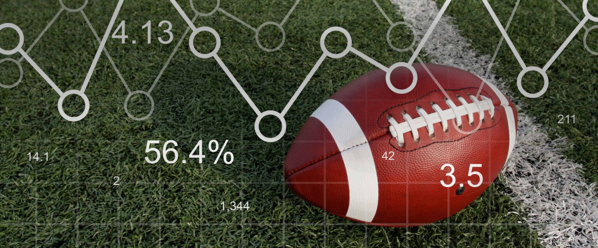

[![Issues][issues-shield]][issues-url]


*Image Source: nfldraftdiamonds*


<h1 align="center">SnapIQ</h1>
<h3 align="center">NFL Play-By-Play Prediction Platform</h3>
  <p align="center">
    Troy J., Adi B., Romith C.
    <br />
    <br />
    <a href="https://github.com/rc-9/SnapIQ/issues">Report Bug</a>
    ·
    <a href="https://github.com/rc-9/SnapIQ/issues">Request Feature</a><br />
  </p>
</div>

<!-- TABLE OF CONTENTS -->
<details>
  <summary>Table of Contents</summary>
  <ol>
    <li><a href="#motivation">Motivation</a></li>
    <li><a href="#methodology">Methodology</a></li>
    <li><a href="#key-findings">Key Findings</a></li>
    <li><a href="#conclusions">Conclusions</a></li>
    <li><a href="#usage">Usage</a></li>
  </ol>
</details>


## Project Overview


#### Motivation

NFL play-calling unfolds under extreme time pressure, where even a small informational advantage can swing the outcome. It’s a real-time decision problem, driven by field position, risk tolerance, and the evolving game situation. While modern football analytics excels at post-game evaluation, few tools attempt to predict or guide decisions under a live-game environment. The purpose of this project is to explore the potential of tree-based ensemble methods, motivated by a simple question: can play-calling be predicted based solely on the pre-snap game situation?
<br/>

#### Methodology

SnapIQ frames play prediction as a multi-class classification problem, forecasting play type using pre-snap information from a canonical dataset spanning the 2014-2018 seasons. Key features include down, distance to first down, field position, score differential, time remaining, and timeouts. All features are pre-processed for consistency, with categorical variables indexed, numeric variables scaled, and missing or stale team codes standardized.

This project targets tree-based learning methods of increasing sophistication: 
- **Decision Tree**: for a simple, interpretable baseline
- **Gradient Boosting**: for sequential learning from residual errors
- **XG-Boost**: an optimized gradient-boosting framework with built-in regularization and parallelization for runtime efficiency

Each model is trained on a shared feature set, with hyperparameters tuned to balance predictive performance, interpretability, and speed, in order to reflect the constraints of a live-game decision support system. A season-based train/test split is used to ensure realistic evaluation and prevent information leakage. Rather than optimizing purely for accuracy, this project prioritizes practical deployability.

To mirror real-world usage, SnapIQ extends beyond batch modeling into a simulated streaming environment (on **Databricks**), where sequential game data is processed in order. A **Random Forest** model is applied in this phase to evaluate trade-offs in performance, latency, and operational feasibility. The result is a lightweight predictor capable of informing coaching preparation, defensive alignment, and game-planning workflows, while laying the groundwork for more advanced real-time applications in the future.
<br/>

#### Key Findings

- Tree-based ensembles substantially outperform single decision trees, capturing non-linear interactions between the situational variables 

- Field position, down, and distance to first down emerge as the most influential features

- Predictive accuracy plateaus quickly when restricted to pre-snap situational data, highlighting the inherent uncertainty in play-calling and the limits of prediction without personnel, formation, or coverage information

- XG-Boost offers the best accuracy–runtime tradeoff among the evaluated models, making it well-suited for real-time decision-support scenarios

- Season-based evaluation confirms stable generalization, suggesting that play-calling tendencies are learnable across years, even as teams and personnel change

- Distributed pipelines in a simulated streaming environment can add operational value even when accuracy gains are marginal


#### Conclusions

Ultimately, SnapIQ serves as a practical exploration of how predictive modeling, feature engineering, and scalable pipelines intersect in sports analytics, laying the groundwork for more advanced real-time strategy and forecasting systems. By framing play prediction as a decision-support problem rather than a pure modeling exercise, the project prioritizes clarity, speed, and deployability.

However, play prediction remains a challenging multi-class classification task, marked by class imbalance, strong contextual dependence, and non-linear feature interactions. Limiting the model to pre-snap situational data captures meaningful structure in play-calling behavior, but only to a certain extent. Future iterations could incorporate richer contextual signals such as formations, personnel groupings, and historical tendencies, and also explore sequential or reinforcement learning approaches to better model strategic decision-making over the course of a game.
<br/>


<p align="right">(<a href="#top">back to top</a>)</p>


## Usage

- ```4442_NFLClassification.R```: Runs the full offline modeling pipeline: data preparation, feature engineering, model training, and evaluation for decision trees, gradient boosting, and XG-Boost.

- ```4442_NFLClassification.Rmd```: Annotated walkthrough of the modeling pipeline with visuals, intermediate results, and supporting discussion / technical reasoning (feature selection, model choice, evaluation strategy, etc.).

- ```simulated_stream_predictor.py```: Simulates real-time streaming by sequentially ingesting season-ordered game data and applying a trained model, highlighting operational considerations such as latency, feature consistency, and inference stability.

<p align="right">(<a href="#top">back to top</a>)</p>


<!-- MARKDOWN LINKS & IMAGES -->
[issues-shield]: https://img.shields.io/github/issues/rc-9/SnapIQ.svg?style=for-the-badge
[issues-url]: https://github.com/rc-9/SnapIQ/issues
